# Deep Learning and Digital Signal Processing for Environmental Sound Classification

 

## Introduction
 
Automatic environmental sound classification (ESC) based on ESC-50 dataset (and ESC-10 subset) built by Karol Piczak and described in the following article:   
 
"Karol J. Piczak. 2015. <b><i>"ESC: Dataset for Environmental Sound Classification."</i></b> In Proceedings of the 23rd ACM international conference on Multimedia (MM '15). Association for Computing Machinery, New York, NY, USA, 1015–1018. https://doi.org/10.1145/2733373.2806390".  
 
ESC-50 dataset is available from Dr. Piczak's Github: https://github.com/karoldvl/ESC-50/
The following recent article is a descriptive survey for Environmental sound classification (ESC) detailing datasets, preprocessing techniques, features and classifiers. And their accuracy.  
 
Anam Bansal, Naresh Kumar Garg, <b><i>"Environmental Sound Classification: A descriptive review of the literature,</i></b> Intelligent Systems with Applications, Volume 16, 2022, 200115, ISSN 2667-3053, https://doi.org/10.1016/j.iswa.2022.200115.   
 

Dr. Piczak maintains a Table with best results in his Github, with authors, publication, method used. We reproduce the top of the Table here, for supervised classification. 

| Title | Notes | Accuracy | Paper | Code |
| :--- | :--- | :--- | :--- | :--- |
| **BEATs: Audio Pre-Training with Acoustic Tokenizers** | Transformer model pretrained with acoustic tokenizers | 98.10% | [chen2022](https://arxiv.org/pdf/2212.09058.pdf) | <a href="https://aka.ms/beats">:scroll:</a>   |
| **HTS-AT: A Hierarchical Token-Semantic Audio Transformer for Sound Classification and Detection** | Transformer model with hierarchical structure and token-semantic modules | 97.00% | [chen2022](https://arxiv.org/pdf/2202.00874.pdf) | <a href="https://github.com/RetroCirce/HTS-Audio-Transformer">:scroll:</a>   |
| **CLAP: Learning Audio Concepts From Natural Language Supervision** | CNN model pretrained by natural language supervision | 96.70% | [elizalde2022](https://arxiv.org/pdf/2206.04769.pdf) | <a href="https://github.com/microsoft/CLAP">:scroll:</a> |
| **AST: Audio Spectrogram Transformer** | Pure Attention Model Pretrained on AudioSet | 95.70% | [gong2021](https://arxiv.org/pdf/2104.01778.pdf) | <a href="https://github.com/YuanGongND/ast">:scroll:</a> |
| **Connecting the Dots between Audio and Text without Parallel Data through Visual Knowledge Transfer** | A Transformer model pretrained w/ visual image supervision | 95.70% | [zhao2022](https://arxiv.org/pdf/2112.08995.pdf) | <a href="https://github.com/zhaoyanpeng/vipant">:scroll:</a> |
 

We develop our own pre-processing techniques for achieving best accuracy results based on Dr. Piczak Table and <i>Bansal et al.</i> 
  <b> At that point, and before we start working on more advanced techniques:
 - we work with the ESC-10 sub-dataset.
 - we test mel-spectrograms and wavelet transforms.   
 
 We will train a Convolution Neural Network with grayscale spectrograms and scalograms. We target an accuracy >>90 %. </b>  
 When tests with the most effective CNN algorithm implementation are completed, we will run predictions with various audio clips downloaded from Youtube. And eventually update CNN hyperparameters. 

## ESC-10 Type of sounds/noises   
 
 The ESC-10 dataset contains 5 seconds long <b>400 Ogg Vorbis audio clips</b>: sampling frequency: 44.1 kHz, 32- bits float,  and <b>10 classes</b>.   40 audio clips per class.    The 10 Sound/Noise classes are:     
 
  
- Class = 01-Dogbark, Label = 0
- Class = 02-Rain, Label = 1
- Class = 03-Seawaves, Label = 2
- Class = 04-Babycry, Label = 3
- Class = 05-Clocktick, Label = 4
- Class = 06-Personsneeze, Label = 5
- Class = 07-Helicopter, Label = 6
- Class = 08-Chainsaw, Label = 7
- Class = 09-Rooster, Label = 8
- Class = 10-Firecrackling, Label = 9

Quick analysis of the type of sound/noise:   
    
- dogbarking, babycry, person sneeze, rooster, involve non-linear vibration and resonance of vocal (or nasal) tract and cords, a bit like speech, and is considered non-stationnary. 
- Rain, sea waves are somewhat stationary, rain sounds a bit like white noise. Pseudo-stationnary because in various audio clips other noises are involved at times. 
- Helicopter, chainsaw: pseudo-stationary. If the engine r.p.m does not change in a timeframe, the process is stationary. With harmonics linked to the engine rpm, number of cylinders, and the number of rotor blades (helicopter).  
- Fire crakling: impulsive noise. But with pseudo-stationary background noise.  
- Clock tick: It depends. Impulsive every second (frequency= 1 Hz). But in some audio clips, there are several "pulsations" in a  1 second time frame. And the ticks have the signature of a non-linear mechanical vibration that radiates sound, with harmonics.
 
## Quick Literature review
 

 
## Methodology
 
- In an effort to reduce the size of the problem and computation time, while retaining relevant information, we:  
    - reduce audio sampling frequency from 44.1 kHz to 22.05 kHz.     
    - reduce the size of audio clips, to 1.25s, based on signal power considerations. Too many audio clips have occurences of the same sound phenomenon: dog barking, baby crying for example and most of the signal is "silence". 
- Normalize audio signal amplitude to 1. (0 dBFS). 
- Compute mel-spectrograms or Wavelet transforms in the 10 classes. We empirically optimized wavelet selection. And wavelet transform parameters. 
- Reduce the size of scalograms in the time domain (some details are lost).
- Train a CNN on 256x256 grayscale mel-spectrograms or 2 series of 128x128 grayscale scalograms: magnitude and phase. Train/Test split: 80/20 %
 
We tested three methods: 

- Mel-spectrograms.
- Complex Continuous Wavelet Transforms (complex CWT).
- Fusion mel-spectrograms + complex CWT.   

After a 80\%/20% train/test sets split, we train a Convolutional Neural Networks with 32-64-128-256 neurons hidden layers. Parameters are detailed in the notebooks CNN section.  
Note: Although mel-spectrograms and wavelet transforms are shown in color, the CNN is trained with grayscale images.   
 
 
## ESC-10  Results Synthesis  
 
Best accuracy with 3 different methods are synthesized in the the Table below. 
 
| Method | Accuracy |
| :--- | :--- |
|  256x256 Mel-spectrograms |      92.5 %    |
|  128x128 Complex CWT Scalograms Magnitude + Phase |    <b> 94 % </b> |
| 128x128 Fusion Complex CWT + Mel-Spectrograms | <b>99 %</b>  |
 
Details of the best result with the "Fusion" method:   

 
 
|
   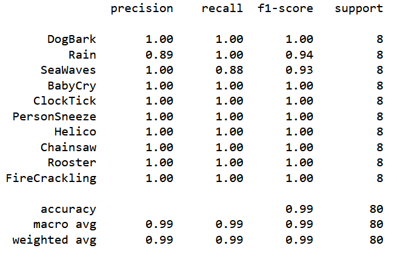 
    |  
 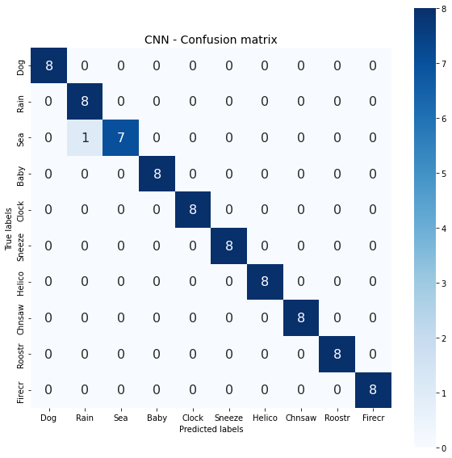 
 |  
| :---       | :---                          |   
|
 <b> Classification report </b> 
  |  
 <b> Confusion matrix </b> 
       |  

 

 
  
  
 

## Jupyter Notebooks  
 
All Jupyter Notebooks share the same structure.   
The classification method and the CNN model were updated. Older Jupyter Notebooks: Part I. II. III. are at the bottom. 

### <ul> [Part IV: Fusion: Complex Wavelet Transforms + Mel-Spectrograms and CNN](https://github.com/DrStef/Deep-Learning-and-Digital-Signal-Processing-for-Environmental-Sound-Classification/blob/main/ESC10-Sound-Classification-WaveletMelSpecTransforms_Fusion_v04_rev2.ipynb)  </ul>

This notebook is an improved version of Part III. <b>We implement a 2-stages classification process</b>: 

<b>STAGE I: Pre-classification</b>

We define two sounds classes A,B:

- “Harmonics sounds”: <i> Dog barking, Baby cry, Clock tick, Person sneeze, Helicopter, Chainsaw, Rooster. </i>
- “Non-harmonics sounds”: <i> Rain, Seawaves, Fire crackling.  </i>

 

| 
   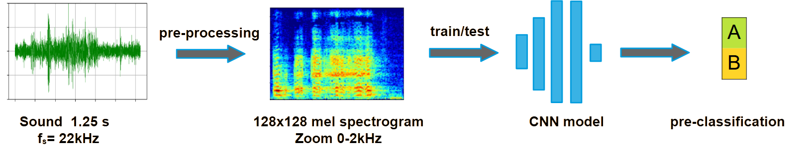 
 |
| --- | 
|
 <b><i> Methodology:  Stage I  </i></b> 
 |

   Results:
    
|
   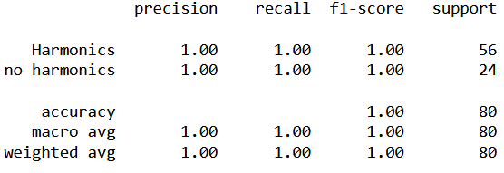 
 | 
 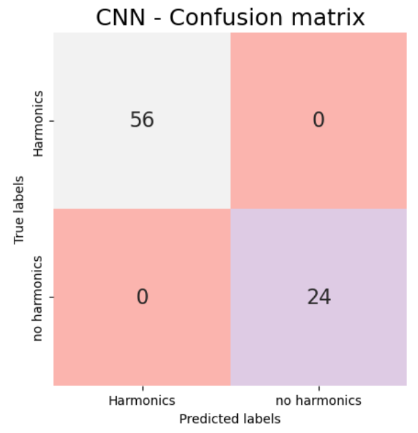 
 |  
| ---       | ---       |   
|
 <b><i> Classification report </i></b> 
 | 
 <b><i> Confusion matrix </i></b> 
|

A 100% acuracy classification was achieved with Mel-spectrograms defined between 0-2000Hz and a CNN model.    
<b> At the moment this stage is left as an exercise. </b> We will propose a simpler method. 

<b>STAGE II: Classification:</b>

We apply two sets of complex continuous wavelets to each sound class A, B and run the whole classification problem with a multi-feature CNN: CWT Magntitude and Phase + Mel-spectrograms

  
| 
   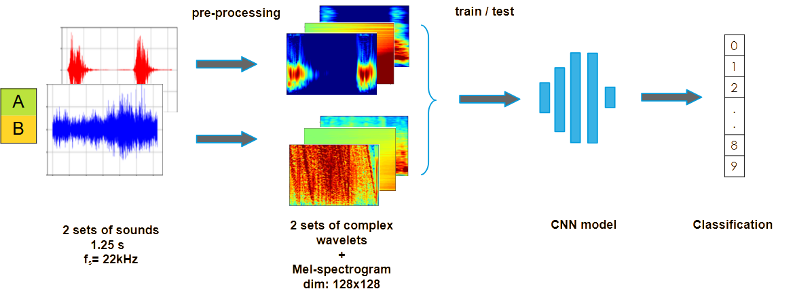 
 |
| --- |  
|
 <b><i> Methodology Stage II  </i></b> 
 |   

<b>RESULTS:</b>

|
    
 | 
  
 |  
| ---       | ---       |   
|
<b><i> Classification report </i></b> 
 | 
 <b><i> Confusion matrix </i></b> 
 | 

The remaining confusion: "sea wave" "rain" is solved by developping a transform of the CWT: <i> aT-CWT </i>.  
Preliminary results are presented in Part V.  The <i> aT-CWT </i> transform is currently confidential. 

### <ul> Part V: the aT-CWT transform

Discriminating "sea wave" and "rain" is a challenge given the quasi Gaussian nature of the sound in both cases.  
We were able to solve it with a criteria replacing the unwrap CWT phase and we achieved <b> 100% accuracy</b>.    
This criteria is an advanced Transform of the CWT that we called <i>aT-CWT</i>  
The new <i>aT-CWT</i> transform:
    
- can have the dimensions of the other features: Mel spectrograms, CWT magnitude and phase. In the present study: 128x128.
- the time localization info of the CWT is lost. <i>aT-CWT</i>  makes sense for:
    - stationary, pseudo-stationary sounds even for large period of time (here 1.25s) which is the case with the "no-harmonics" sounds in the present ESC-10 dataset.
    - any type of signals (including non stationary) in very short time frames. For example: speech, frame= 32 ms, fs= 16kHz (512 points). 
  
    
Using the strategy decribed in this Notebook, and replacing the unwrap CWT phase with the new <i>aT-CWT</i> Transform in the "no-harmonics" subset, <b> we were able to reach 100% accuracy. </b>  
    
|
   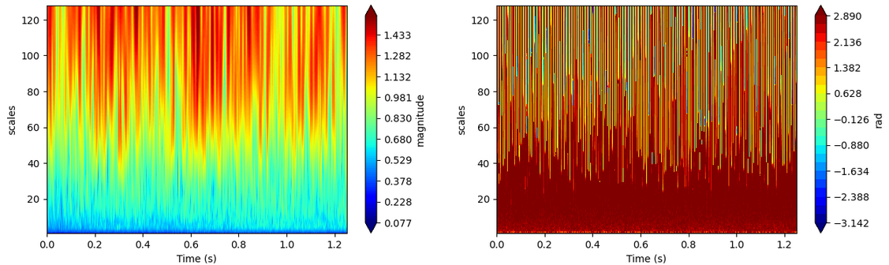 
 | 
| ---       | 
|
<b><i> CWT of a ESC-10 'Sea Wave' (116): Magnitude + Phase </i></b> 
 | 
     
    
| 
 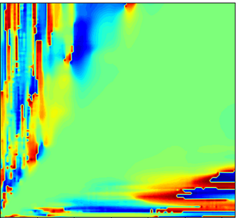 
 |  
| ---       |   
| 
 <b><i> Transform of the CWT:  aT-CWT   Units are hidden. </i></b> 
 |     
    
At the moment, the <i>aT-CWT</i> Transform is confidential.   At some point, it will be published and the ESC-10 notebook with 100% accuracy will be made public. 

|
   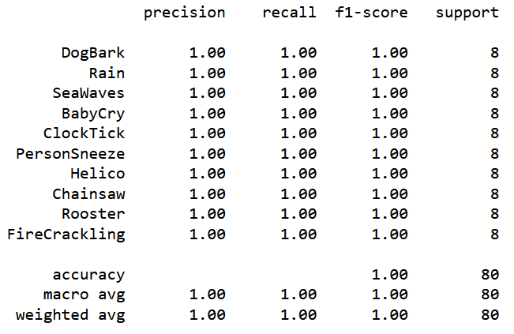 
 | 
 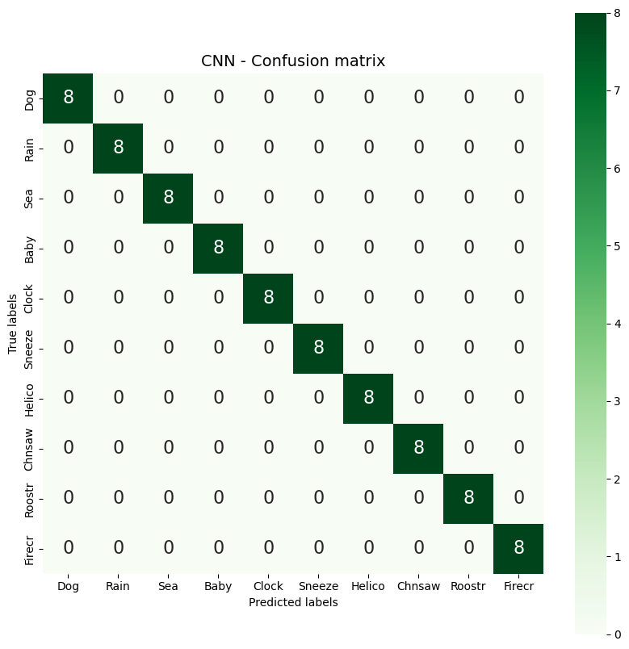 
 |  
| ---       | ---       |   
|
<b><i> Classification report </i></b> 
 | 
 <b><i> Confusion matrix </i></b> 
 | 

 

## Older Notebooks 
 
 
Initial tests with Mel-Spectrogram, complex CWT, and multi-feature Mel-spectrogram + complex CWT CNN models. 

 
 ###  <ul> [Part I: Mel-Spectrograms and Convolutional Neural Networks (CNN)](https://github.com/DrStef/Deep-Learning-and-Digital-Signal-Processing-for-Environmental-Sound-Classification/blob/main/ESC10-Sound-Classification-Mel-Spectrograms_v04.ipynb) </ul>

Reduction of audio clips length and optimization of mel-spectrogram parameters for best discrimination of sound categories. We train the CNN with 256x256 grayscale images. Accuracy: ~92.5%
 

 

| 
 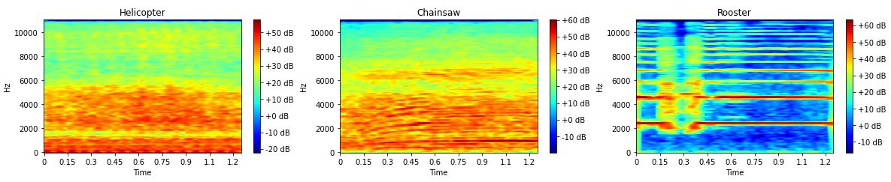 
  |  
|                           :---                                          |  
| 
 <b><i> Mel-spectrograms (dB)</i></b> 
       |  

 
 
 
 
 

### <ul>[Part II: Complex Wavelet Transform and Convolutional Neural Networks (CNN)](https://github.com/DrStef/Deep-Learning-and-Digital-Signal-Processing-for-Environmental-Sound-Classification/blob/main/ESC10-Sound-Classification-WaveletTransforms_phase_v06.ipynb) </ul>
 
 
Optimization of wavelet selection and parameters for best discrimination of sound classes.  
Wavelet selection: the difficulty here is the selection of the right wavelet suited to the full range of noise types: pseudo-stationary, non-stationary, transient/impulsive.  
Applying different wavelets to each type of sound significantly improves classification accuracy. We train the CNN with 2 128x128 grayscale images per audio clip: scalogram magnitude and phase. Accuracy <b> ~ 94%. </b> 

 

|
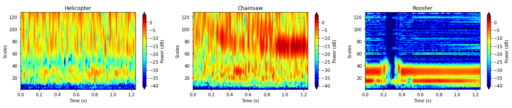 
 | 
|                                             :---                          |  
| 
 <b> <i>Scalograms magnitude (dB)</i></b> 
      |  

 

 

| 
 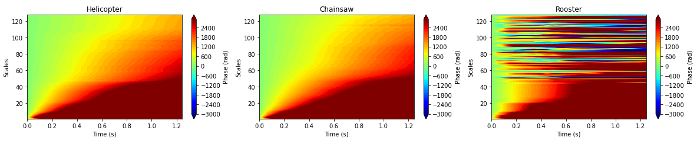 
  |  
|                           :---                                          |  
| 
 <b><i> Scalograms phase (rad)</i></b> 
       |  

 

    

### <ul> [Part III: Fusion: Complex Wavelet Transforms + Mel-Spectrograms and CNN](https://github.com/DrStef/Deep-Learning-and-Digital-Signal-Processing-for-Environmental-Sound-Classification/blob/main/ESC10-Sound-Classification-WaveletMelSpecTransforms_Fusion_v03.ipynb)  </ul>
 
Combining Mel-Spectrograms (Part I) with Complex Wavelets Transforms (Part II) enhances accuracy with features that are difficult to discriminate. We train the CNN with 3 128x128 grayscale images per audio clip.  Accuracy. <b> ~ 99%. </b>
  

 
 

| 
 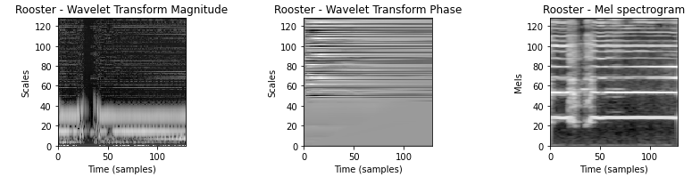 
  |  
|                           :---                                          |  
| 
 <b> <i>Rooster: Scalogram Magnitude (dB),  Phase (rad) + Mel-spectrogram (dB)</i></b> 
       |  

 

 
 
 
 

> ###### [Overview](#esc-50-dataset-for-environmental-sound-classification) | [Download](#download) | [Results](#results) | [Repository content](#repository-content) | [License](#license) | [Citing](#citing) | [Caveats](#caveats) | [Changelog](#changelog)
>
> &nbsp;
<a href="LICENSE">&nbsp;
&nbsp;

  The **ESC-50 dataset** is a labeled collection of 2000 environmental audio recordings suitable for benchmarking methods of environmental sound classification.

  The dataset consists of 5-second-long recordings organized into 50 semantical classes (with 40 examples per class) loosely arranged into 5 major categories:
    
    
    
| Class | Label | 
| :--- | :--- |
| Dog bark| 0 | 
| Rain | 1 | 
| Seawaves | 2 | 
| Baby cry | 3| 
| Clock tick | 4 |
| Person sneeze | 5 | 
| Helicopter | 6 | 
| Chainsaw | 7 | 
| Rooster | 8 | 
| Firecrackling | 9 | 

 Clips in this dataset have been manually extracted from public field recordings gathered by the **[Freesound.org project](http://freesound.org/)**. The dataset has been prearranged into 5 folds for comparable cross-validation, making sure that fragments from the same original source file are contained in a single fold.

  A more thorough description of the dataset is available in the original [paper](http://karol.piczak.com/papers/Piczak2015-ESC-Dataset.pdf) with some supplementary materials on GitHub: **[ESC: Dataset for Environmental Sound Classification - paper replication data](https://github.com/karoldvl/paper-2015-esc-dataset)**.

### Repository content

- [`audio/*.wav`](audio/)

  2000 audio recordings in WAV format (5 seconds, 44.1 kHz, mono) with the following naming convention:
  
  `{FOLD}-{CLIP_ID}-{TAKE}-{TARGET}.wav`
  
  - `{FOLD}` - index of the cross-validation fold,
  - `{CLIP_ID}` - ID of the original Freesound clip,
  - `{TAKE}` - letter disambiguating between different fragments from the same Freesound clip,
  - `{TARGET}` - class in numeric format [0, 49].

- [`meta/esc50.csv`](meta/esc50.csv)

  CSV file with the following structure:
  
  | filename | fold | target | category | esc10 | src_file | take |
  | :--- | :--- | :--- | :--- | :--- | :--- | :--- |
  
  The `esc10` column indicates if a given file belongs to the *ESC-10* subset (10 selected classes, CC BY license).
  
- [`meta/esc50-human.xlsx`](meta/esc50-human.xlsx)

  Additional data pertaining to the crowdsourcing experiment (human classification accuracy).

### Package Requirements

To run the code and reproduce the results,

1. Download Anaconda for Python 3: https://www.anaconda.com/products/individual 
2. Install Jupyter Lab: conda install -c conda-forge jupyterlab 
3. Install Jupyer Notebook: conda install -c conda-forge notebook 
4. Upload the prepared conda environment: conda env create -f stephane_dedieu_sound_classification.yml 
   Activate the environment: conda activate stephane_dedieu_sound_classification 
5. Alternative to 4: pip install -r requirements.txt
   Sometimes librosa will not install, you can try then:
    -conda install -c numba numba
    -conda install -c conda-forge librosa
7. Run the notebook: jupyter notebook 

Ensure you have the following Python packages installed:
 
- pandas
- matplotlib
- numpy
- scikit-learn
- keras
- pydot
- tensorflow
- librosa
- glob2
- keras
- notebook
- librosa
- seaborn
- scikit-image

You can install these packages using pip:

pip install numpy pandas matplotlib seaborn scikit-learn tensorflow librosa 

Using conda you can replicate the environment in stephane_dedieu_sound_classification.yml:  
conda env create -n ENVNAME --file   stephane_dedieu_sound_classification.yml

### License

  The dataset is available under the terms of the [Creative Commons Attribution Non-Commercial license](http://creativecommons.org/licenses/by-nc/3.0/). 
A smaller subset (clips tagged as *ESC-10*) is distributed under CC BY (Attribution).  
Attributions for each clip are available in the [ LICENSE file](LICENSE).

### Citing

  If you find this dataset useful in an academic setting please cite:

> K. J. Piczak. **ESC: Dataset for Environmental Sound Classification**. *Proceedings of the 23rd Annual ACM Conference on Multimedia*, Brisbane, Australia, 2015.
> 
> [DOI: http://dx.doi.org/10.1145/2733373.2806390]

    @inproceedings{piczak2015dataset,
      title = {{ESC}: {Dataset} for {Environmental Sound Classification}},
      author = {Piczak, Karol J.},
      booktitle = {Proceedings of the 23rd {Annual ACM Conference} on {Multimedia}},
      date = {2015-10-13},
      url = {http://dl.acm.org/citation.cfm?doid=2733373.2806390},
      doi = {10.1145/2733373.2806390},
      location = {{Brisbane, Australia}},
      isbn = {978-1-4503-3459-4},
      publisher = {{ACM Press}},
      pages = {1015--1018}
    }

The ESC-10 subset is licensed as a Creative Commons Attribution 3.0 Unported  
(https://creativecommons.org/licenses/by/3.0/) dataset.

Licensing/attribution details for individual audio clips are available in file:  

 
[License](https://github.com/DrStef/Deep-Learning-and-Digital-Signal-Processing-for-Environmental-Sound-Classification/blob/main/LICENSE)
