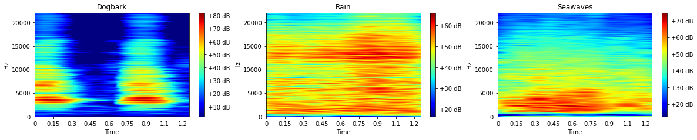

# Deep Learning and Digital Signal Processing for Environmental Sound Classification

ESC-10 Dataset: We are going to use ESC-10 dataset for sound classification. It is a labeled set of 400 environmental recordings (10 classes, 40 clips per class, 5 seconds per clip). It is a subset of the larger ESC-50 dataset

https://github.com/karoldvl/ESC-50/

Each class contains 40 .ogg files. The ESC-10 and ESC-50 datasets have been prearranged into 5 uniformly sized folds so that clips extracted from the same original source recording are always contained in a single fold.

We develop our own pre-processing techniques. 

### Type of sounds/noises:  
 
 
    
- Class = 01-Dogbark, Label = 0
- Class = 02-Rain, Label = 1
- Class = 03-Seawaves, Label = 2
- Class = 04-Babycry, Label = 3
- Class = 05-Clocktick, Label = 4
- Class = 06-Personsneeze, Label = 5
- Class = 07-Helicopter, Label = 6
- Class = 08-Chainsaw, Label = 7
- Class = 09-Rooster, Label = 8
- Class = 10-Firecrackling, Label = 9

### Mel-Spectrograms and Convolutional Neural Networks

 
  
 

### Wavelet transform and Convolutional Neural Networks

