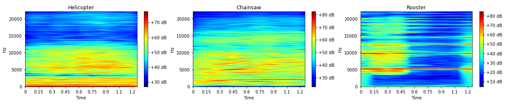

# Deep Learning and Digital Signal Processing for Environmental Sound Classification

 
 

## Introduction
 
Automatic environmental sound classification (ESC) based on ESC-50 dataset (and ESC-10 subset) built by Karol Piczak and described in the following article:   
 
"Karol J. Piczak. 2015. <b><i>"ESC: Dataset for Environmental Sound Classification."</i></b> In Proceedings of the 23rd ACM international conference on Multimedia (MM '15). Association for Computing Machinery, New York, NY, USA, 1015–1018. https://doi.org/10.1145/2733373.2806390".  
 
ESC-50 dataset is available from Dr. Piczak's Github: https://github.com/karoldvl/ESC-50/
The following recent article is a descriptive survey for Environmental sound classification (ESC) detailing datasets, preprocessing techniques, features and classifiers. And their accuracy.  
 
Anam Bansal, Naresh Kumar Garg, <b><i>"Environmental Sound Classification: A descriptive review of the literature,</i></b> Intelligent Systems with Applications, Volume 16, 2022, 200115, ISSN 2667-3053, https://doi.org/10.1016/j.iswa.2022.200115.   
 
We develop our own pre-processing techniques for achieving best accuracy results based on <i>Bansal et al.</i> 
  <b> At that point, and before we start working on more advanced techniques, we test mel-spectrograms and wavelet transforms.   We will train a Convolution Neural Network with spectrograms and scalograms.  We target an accuracy >90 %.   </b>    

## Type of sounds/noises   
 
 The ESC-10 dataset contains 5 seconds long <b>400 Ogg Vorbis audio clips</b>: sampling frequency: 44.1 kHz, 32- bits float,  and <b>10 classes</b>.   40 audio clips per class.    The 10 sound/Noise classes are:     
 
  
- Class = 01-Dogbark, Label = 0
- Class = 02-Rain, Label = 1
- Class = 03-Seawaves, Label = 2
- Class = 04-Babycry, Label = 3
- Class = 05-Clocktick, Label = 4
- Class = 06-Personsneeze, Label = 5
- Class = 07-Helicopter, Label = 6
- Class = 08-Chainsaw, Label = 7
- Class = 09-Rooster, Label = 8
- Class = 10-Firecrackling, Label = 9

Quick analysis of the type of sound/noise:   
    
- dogbarking, babycry, person sneeze, rooster, involve non-linear vibration and resonance of vocal (or nasal) tract and cords, a bit like speech, and is considered non-stationnary. 
- Rain, sea waves are somewhat stationary, rain sounds a bit like white noise. Let's say pseudo-stationnary because in various audio clips other noises are involved at times. 
- Helicopter, chainsaw: pseudo-stationary. If the engine r.p.m does not change in a timeframe, the process is stationary. With harmonics linked to the engine rpm, number of cylinders, and the number of rotor blades (helicopter).  
- Fire crakling: impulsive noise. 
- Clock tick: It depends. Impulsive every second (frequency= 1 Hz). But in some audio clips, there are several "pulsations" in a  1 second time frame. And the ticks have the signature of a non-linear mechanical vibration that radiates sound, with harmonics.
 
   
Before we start developing more advanced techniques, we test mel-spectrograms and wavelets. With optimized pre-processing.   We will train a Convolution Neural Network model.  <b> At that point, we target an accuracy >= 90 %  </b> 
 
##  Mel-Spectrograms and Convolutional Neural Networks

Optimization of mel-spectrogram parameters for best discrimination of sound categories. 

  
 

##  Wavelet transform and Convolutional Neural Networks
    
Optimization of wavelet selection and parameters for best discrimination of sound categories.  
Wavelet selection: the difficulty here is the selection of the right wavelet suited to the full range of noise types: pseudo-stationary, non-stationary, transient/impulsive.  
<b>Applying different wavelets to each type of sound significantly improves CNN Deep Learning accuracy.</b> Above 90%.   In this notebook we test the selection of different types of wavelets depending on the type of sound.  
 
 
 
 

  
 
